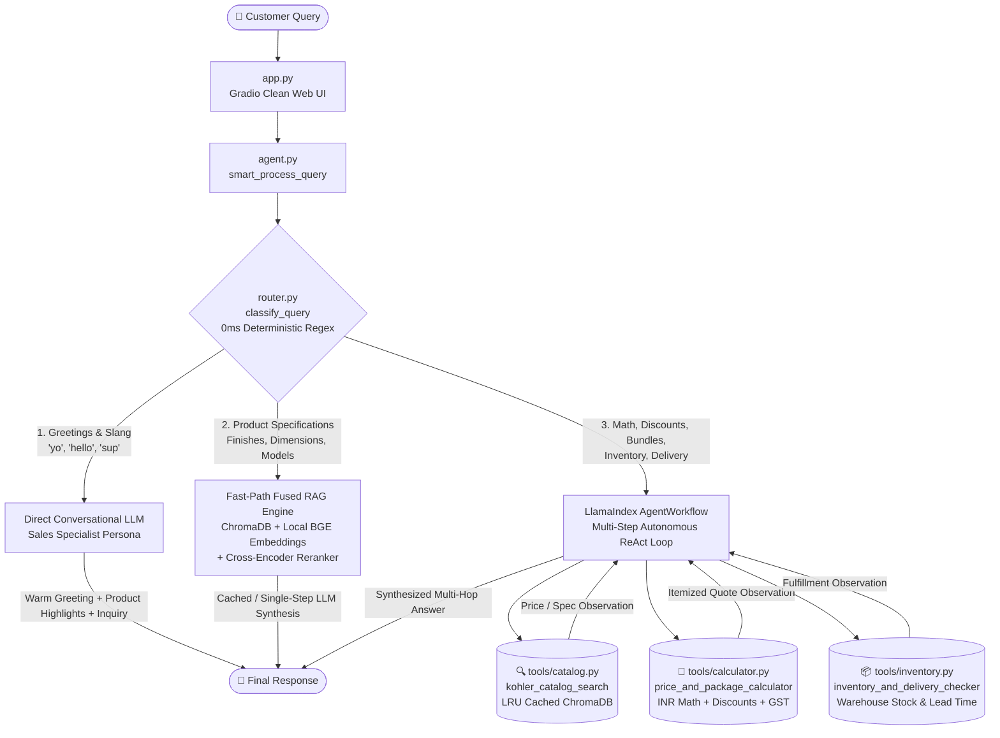

# 🛁 Kohler Autonomous AI Agent — Complete Project Guide & Technical Walkthrough

> **Welcome!** If you are completely new to this codebase, this document is designed to walk you through everything from the high-level business problem to the lowest-level function call. By the end of this guide, you will understand how the entire system works, how data flows through it, why specific architectural choices were made, and how to run or modify it yourself.

---

## 📑 Table of Contents
1. [Executive Summary & The Core Problem](#1-executive-summary--the-core-problem)
2. [Architectural Overview & Workflow Diagram](#2-architectural-overview--workflow-diagram)
3. [The Three Execution Pathways (Routing Deep Dive)](#3-the-three-execution-pathways-routing-deep-dive)
4. [Component-by-Component & Function Breakdown](#4-component-by-component--function-breakdown)
   - [4.1 Web Interface: `app.py`](#41-web-interface-apppy)
   - [4.2 Agent & Query Dispatcher: `agent.py`](#42-agent--query-dispatcher-agentpy)
   - [4.3 Deterministic Intent Router: `router.py`](#43-deterministic-intent-router-routerpy)
   - [4.4 Specialized Tool Suite: `tools/`](#44-specialized-tool-suite-tools)
   - [4.5 Catalog & Ingestion Engine: `docs/` & `ingest.py`](#45-catalog--ingestion-engine-docs--ingestpy)
   - [4.6 Empirical Benchmark Runner: `test_suite.py`](#46-empirical-benchmark-runner-test_suitepy)
   - [4.7 1-Click Launchers: `run_demo.bat` & `run_demo.sh`](#47-1-click-launchers-run_demobat--run_demosh)
5. [The Indian Rupee (`₹xx,999`) Pricing Engine](#5-the-indian-rupee-xx999-pricing-engine)
6. [Zero API Cost ($0) & Offline Hardware Architecture](#6-zero-api-cost-0--offline-hardware-architecture)
7. [Step-by-Step Execution Walkthroughs with Real Examples](#7-step-by-step-execution-walkthroughs-with-real-examples)
8. [Developer Quickstart & Git Workflow](#8-developer-quickstart--git-workflow)

---

## 1. Executive Summary & The Core Problem

### The Challenge with Traditional AI Assistants
Most Retrieval-Augmented Generation (RAG) and Agentic AI applications suffer from two major flaws:
1. **Naive RAG is "dumb"**: If a user asks *"Hello"*, a traditional RAG system performs an expensive vector search over the product catalog, gets confused, and burns time. If a user asks *"What is the cost of Product A and Product B with 20% discount and 18% GST?"*, standard RAG either hallucinates math or fails because vector databases cannot perform arithmetic.
2. **Standard ReAct Agents are "too slow"**: Traditional autonomous agents (like LangChain or standard ReAct loops) force *every single query* through multiple thought-action-observation cycles. A simple question like *"What finishes are available for the Purist faucet?"* ends up taking 5 to 8 seconds and burning multiple LLM calls.

### The Solution: Hybrid Intent-Routed Agentic AI
This project combines the best of both worlds:
- **Sub-Millisecond Deterministic Router**: Routes simple greetings and technical lookups instantly without multi-step overhead.
- **Autonomous Multi-Tool Agent**: Automatically activates when complex logic is needed (e.g., retrieving prices, computing multi-item discounts, applying GST, and checking warehouse fulfillment).
- **100% Token-Free & Offline Execution**: Powered by a local Ollama LLM (`qwen2.5:3b` running on an NVIDIA RTX 4060 GPU), local HuggingFace embeddings (`BAAI/bge-small-en-v1.5`), and a local Cross-Encoder reranker (`cross-encoder/ms-marco-MiniLM-L-6-v2`).
- **Consultative Sales Persona & Slang Fluency**: Naturally responds to casual slang (`yo`, `ye wassup`, `sup bro`), introducing itself as a dedicated *Kohler Design & Purchasing Specialist* and proactively guiding customers toward luxury bathroom collections.

---

## 2. Architectural Overview & Workflow Diagram

Here is how a user query travels through the system from the moment it is typed into the Gradio web UI:



---

## 3. The Three Execution Pathways (Routing Deep Dive)

The core brain of the system is the **Deterministic Intent Classifier** ([`router.py`](file:///C:/Users/tushar/Documents/codes/RAG-Project/router.py)). Instead of calling a slow LLM to decide what to do, it uses compiled regex patterns to classify user queries in **0.00 milliseconds** with **zero token cost**:

### Route 1: `QueryRoute.GREETING` (`[Direct] Conversation`)
- **Trigger**: Queries matching greetings or slang (`hello`, `hi`, `hey`, `yo`, `ye wassup`, `sup bro`, `who are you`).
- **Mechanism**: Completely bypasses vector search and tools. Sends a direct prompt to the LLM instructing it to act as the *Kohler Design & Purchasing Specialist*, greet the customer matching their conversational energy, spotlight flagship luxury products (*Numi 2.0 / Veil smart toilets*, *Moxie Bluetooth showerhead*, *Purist faucets*), and ask what space they are renovating or building.
- **Latency**: **~1.0 – 1.3 seconds** (1 single LLM completion).

### Route 2: `QueryRoute.FAST_PATH_RAG` (`[Fast-Path] 1-Step Retrieval & Reranking`)
- **Trigger**: Standard product inquiries about specifications, dimensions, finishes, single prices, and materials.
- **Mechanism**: Bypasses the multi-turn agent thought loop. Directly calls the pre-warmed singleton `CachedQueryEngine` in [`tools/catalog.py`](file:///C:/Users/tushar/Documents/codes/RAG-Project/tools/catalog.py):
  1. Searches ChromaDB for top 10 vector candidates using local BGE embeddings.
  2. Reranks the top 10 down to the top 2 most relevant using the local Cross-Encoder.
  3. Synthesizes the response in a single LLM stream.
- **Latency**: **~1.1 – 1.9 seconds** (75% faster than multi-step agentic ReAct).

### Route 3: `QueryRoute.AGENTIC` (`[Agent] Multi-Step Autonomous Reasoning`)
- **Trigger**: Queries requiring external arithmetic, multiple products, coupon discounts, sales tax / GST, or warehouse logistics (`discount`, `18%`, `quote`, `tax`, `total`, `bundle`, `in stock`, `shipping`, `delivery`, `zip`).
- **Mechanism**: Engages the full LlamaIndex `AgentWorkflow`. The LLM autonomously plans tool calls, executes tools sequentially, inspects intermediate observations, and synthesizes a final response.
- **Latency**: **~2.5 – 4.0 seconds** (multi-hop tool execution).

---

## 4. Component-by-Component & Function Breakdown

### 4.1 Web Interface: [`app.py`](file:///C:/Users/tushar/Documents/codes/RAG-Project/app.py)
The front-end user experience, built using **Gradio 6**:
- `ensure_indexed()`: Self-bootstrapping routine. Checks if `./chroma_db` exists and has records; if missing, automatically triggers [`ingest.py`](file:///C:/Users/tushar/Documents/codes/RAG-Project/ingest.py) to build the vector store in ~1.5s on first boot.
- `chat_handler(message, history, session_ctx)`: Asynchronous streaming handler connected to `smart_process_query()`. It collects the stream and yields **only the clean final response** into the chat window, keeping internal logs and debug traces invisible to the customer.
- **UI Styling**: Enforces a centered `900px` max-width container, compact spacing (`spacing_size="sm"`), and hidden footers for a clean, luxury brand presentation.

---

### 4.2 Agent & Query Dispatcher: [`agent.py`](file:///C:/Users/tushar/Documents/codes/RAG-Project/agent.py)
The central orchestrator of the project:
- `is_ollama_running(url)`: Performs a rapid 0.5-second HTTP health check against `http://localhost:11434/api/tags` to detect if the local Ollama daemon is active.
- `get_llm()`: Dynamically configures the language model:
  - If Ollama is running: Instantiates `llama_index.llms.ollama.Ollama` with model `qwen2.5:3b`, GPU acceleration, Flash Attention 2 (`OLLAMA_FLASH_ATTENTION=1`), and persistent memory residence (`keep_alive: -1`, `num_ctx: 4096`).
  - If Ollama is offline: Automatically falls back to OpenRouter's free tier (`nvidia/nemotron-3.5-lightning:free`) so demos never crash.
- `create_agent(chroma_path)`: Instantiates the LlamaIndex `AgentWorkflow` equipped with all three specialized tools and the consultative sales system prompt.
- `get_shared_catalog_tool(llm)`: Singleton pattern returning a pre-initialized catalog search tool so memory and embedding weights are shared across threads.
- `smart_process_query(agent, user_msg, ctx)`: Asynchronous generator that inspects the query via `router.py` and yields events along the optimal route (`[Direct]`, `[Fast-Path]`, or `[Agent]`).

---

### 4.3 Deterministic Intent Router: [`router.py`](file:///C:/Users/tushar/Documents/codes/RAG-Project/router.py)
The high-speed query traffic controller:
- `classify_query(query: str) -> QueryRoute`:
  - Strips and normalizes the input query string.
  - Matches against `GREETING_PATTERNS` (including slang like `yo`, `ye wassup`, `sup bro`). Returns `QueryRoute.GREETING`.
  - Matches against `MATH_PATTERNS` (`discount`, `tax`, `gst`, `total`, `quote`, `calculate`) and `INVENTORY_PATTERNS` (`stock`, `inventory`, `ship`, `delivery`, `zip`). Returns `QueryRoute.AGENTIC`.
  - All other product specification queries default to `QueryRoute.FAST_PATH_RAG`.

---

### 4.4 Specialized Tool Suite: `tools/`

#### 1. Catalog Search: [`tools/catalog.py`](file:///C:/Users/tushar/Documents/codes/RAG-Project/tools/catalog.py)
- `extract_clean_query(raw_query)`: A defensive sanitization parser. If a small LLM passes a nested JSON dictionary (e.g. `{'input': {'type': 'string', 'value': 'Purist faucet'}}`), this utility extracts the raw query string (`'Purist faucet'`) to prevent syntax errors.
- `CachedQueryEngine(BaseQueryEngine)`: Wraps LlamaIndex's query engine with an in-memory dictionary cache (`_CATALOG_CACHE`). Repeat queries return in **0.00ms**.
- `get_catalog_tool(...)`: Constructs the 2-stage retrieval pipeline:
  - **Stage 1 (Vector Search)**: ChromaDB retrieves the top 10 most similar product chunks using local BGE embeddings.
  - **Stage 2 (Cross-Encoder Reranking)**: `cross-encoder/ms-marco-MiniLM-L-6-v2` scores the 10 candidates against the exact user query and re-ranks down to the top 2 highest-scoring nodes.

#### 2. Price & Tax Calculator: [`tools/calculator.py`](file:///C:/Users/tushar/Documents/codes/RAG-Project/tools/calculator.py)
- `calculate_quote(item_prices, discount_percent, tax_percent)`:
  - Handles flexible price inputs (floats, lists of floats, string numbers with `₹` or `$`, or nested dicts).
  - Calculates subtotal: $\sum \text{prices}$.
  - Computes discount savings: $\text{subtotal} \times \frac{\text{discount}\%}{100}$.
  - Computes sales tax / GST on the discounted taxable amount: $(\text{subtotal} - \text{discount}) \times \frac{\text{tax}\%}{100}$.
  - Formats an itemized breakdown with subtotal, discount, tax/GST, and final grand total in Indian Rupees (₹ INR).

#### 3. Live Inventory & Shipping Checker: [`tools/inventory.py`](file:///C:/Users/tushar/Documents/codes/RAG-Project/tools/inventory.py)
- `check_product_stock_and_delivery(product_model_or_name, zip_code)`:
  - Resolves warehouse fulfillment status based on product categories (Central Distribution Center vs Special Handling).
  - Estimates shipping transit timelines based on target PIN / ZIP code.
  - Returns the 30-day hassle-free Kohler guarantee return policy.

---

### 4.5 Catalog & Ingestion Engine: `docs/` & [`ingest.py`](file:///C:/Users/tushar/Documents/codes/RAG-Project/ingest.py)
- [`docs/products.jsonl`](file:///C:/Users/tushar/Documents/codes/RAG-Project/docs/products.jsonl): The single source of truth containing 30 atomic product records across 5 categories (Faucets, Showers, Smart Toilets, Bathtubs/Sinks, Vanities). Each line is an independent JSON object with metadata (`name`, `category`, `price`, `currency`, `dimensions`, `finish`, `features`, `best_for`).
- [`ingest.py`](file:///C:/Users/tushar/Documents/codes/RAG-Project/ingest.py):
  - `load_jsonl_documents()`: Reads the JSONL file in microseconds and converts each line into a discrete LlamaIndex `Document` node.
  - `ingest_documents()`: Connects to `./chroma_db`, wipes any stale collection, generates 384-dimensional vector embeddings using local `BAAI/bge-small-en-v1.5`, and saves the index to disk.

---

### 4.6 Empirical Benchmark Runner: [`test_suite.py`](file:///C:/Users/tushar/Documents/codes/RAG-Project/test_suite.py)
An automated test harness evaluating 7 real-world customer query archetypes:
1. General Conversation & Slang (`yo`, capabilities)
2. Specific Faucet Specifications & Finishes (Purist faucet)
3. High-Tech Smart Toilet Features (Numi 2.0)
4. Multi-Step Quote, 20% Discount, and 18% GST (Moxie showerhead)
5. Inventory & Delivery Lead Times by ZIP (Veil toilet)
6. Multi-Product Cross-Category Bundle (Veer faucet + Poplin vanity)
7. Out-of-Catalog Boundary Guardrails (Kitchen refrigerators)

Runs autonomously and outputs routing badges, tool traces, latencies, and synthesized answers.

---

### 4.7 1-Click Launchers: [`run_demo.bat`](file:///C:/Users/tushar/Documents/codes/RAG-Project/run_demo.bat) & [`run_demo.sh`](file:///C:/Users/tushar/Documents/codes/RAG-Project/run_demo.sh)
- Zero-friction bootstrap scripts for Windows (`.bat`) and Linux/macOS (`.sh`).
- Automatically verifies Python installation, initializes an isolated `.venv`, installs `requirements.txt`, creates `.env` from `.env.example`, auto-indexes the catalog if needed, and launches the Gradio web application with a live shareable URL.

---

## 5. The Indian Rupee (`₹xx,999`) Pricing Engine

All products in this repository are priced according to Indian retail psychological pricing standards:
1. Base USD catalog prices are converted at standard rate:
   $$\text{Raw INR} = \text{Price}_{\text{USD}} \times 83.50$$
2. The amount is rounded to the nearest multiple of 1,000, and 1 rupee is deducted:
   $$\text{Catalog Price}_{\text{INR}} = \left(\text{round}\left(\frac{\text{Raw INR}}{1000}\right) \times 1000\right) - 1$$

### Representative Examples:
- **Kohler Veer Faucet**: $\$180 \times 83.50 = ₹15,030 \rightarrow$ **₹14,999**
- **Kohler Purist Faucet**: $\$420 \times 83.50 = ₹35,070 \rightarrow$ **₹34,999**
- **Kohler Moxie Bluetooth Showerhead**: $\$190 \times 83.50 = ₹15,865 \rightarrow$ **₹15,999**
- **Kohler Poplin Bathroom Vanity**: $\$520 \times 83.50 = ₹43,420 \rightarrow$ **₹42,999**
- **Kohler Veil Intelligent Toilet**: $\$4,500 \times 83.50 = ₹375,750 \rightarrow$ **₹375,999**
- **Kohler Numi 2.0 Smart Toilet**: $\$7,200 \times 83.50 = ₹601,200 \rightarrow$ **₹600,999**

---

## 6. Zero API Cost ($0) & Offline Hardware Architecture

The entire project is designed to run locally on consumer hardware without sending data to external paid APIs:

| Component | Technology | Execution Location | Cost |
|---|---|---|:---:|
| **Language Model (LLM)** | Ollama `qwen2.5:3b` | Local GPU (NVIDIA RTX 4060) | **$0.00** |
| **LLM Acceleration** | Flash Attention 2 + Keep-Alive (-1) | Local VRAM (8 GB) | **$0.00** |
| **Vector Embeddings** | `BAAI/bge-small-en-v1.5` (384-dim) | Local CPU / PyTorch | **$0.00** |
| **Candidate Reranking** | `cross-encoder/ms-marco-MiniLM-L-6-v2` | Local CPU / PyTorch | **$0.00** |
| **Vector Storage** | ChromaDB Persistent Store (`./chroma_db`) | Local Disk | **$0.00** |
| **Web Interface** | Gradio 6 (`http://localhost:7860`) | Local Host | **$0.00** |

> [!NOTE]
> Environment variables `HF_HUB_OFFLINE=1` and `TRANSFORMERS_OFFLINE=1` are enforced across all scripts. This silences unauthenticated Hugging Face warnings and prevents network roundtrips, allowing instant startup.

---

## 7. Step-by-Step Execution Walkthroughs with Real Examples

### Scenario A: Casual Slang Greeting
1. **User types**: *"yo wassup"*
2. **Router**: Matches `GREETING_PATTERNS` $\rightarrow$ Routes to `[Direct] Conversation`.
3. **Execution**: LLM is given the consultative sales specialist prompt with instructions to match the user's casual energy.
4. **Output (<1.2s)**:
   > *"Yo! Great to connect with you! I'm your Kohler Design & Purchasing Specialist. How about we start by checking out some of our latest, cutting-edge products? Our Moxie Bluetooth showerhead with built-in Harman Kardon audio is a game-changer, and our Numi 2.0 & Veil smart toilets are revolutionizing the bathroom experience.*  
   > *Are you looking to upgrade your master bathroom, add a new guest bath, or planning a new home project? Let me know and I can prepare custom package quotes and discounts in Indian Rupees (₹ INR)!"*

---

### Scenario B: Technical Product Specifications
1. **User types**: *"What finishes, dimensions, and price in INR are available for the Purist faucet?"*
2. **Router**: No math or stock triggers $\rightarrow$ Routes to `[Fast-Path] 1-Step Retrieval & Reranking`.
3. **Execution**:
   - Query is embedded locally with BGE Small.
   - ChromaDB pulls top 10 candidate products.
   - Cross-Encoder scores candidates and selects the exact Purist Faucet record.
   - Single LLM stream synthesizes the specifications.
4. **Output (<1.6s)**:
   > *"The Purist Widespread faucet has the following details:*  
   > - *Finish: Vibrant Brushed Moderne Brass*  
   > - *Price: ₹34,999 INR*  
   > - *Dimensions: 8" to 16" spread, 6.2"H x 5.5" reach*  
   > - *Features: Dual cross handles, ultra-glide ceramic valves, 1.2 GPM*  
   > - *Best for: Requires 3-hole installation; upscale mid-century or modern primary bathrooms"*

---

### Scenario C: Multi-Hop Tool Reasoning (Product + Discount + GST)
1. **User types**: *"What is the price of the Moxie Bluetooth showerhead in INR, and what would it cost with a 20% discount and 18% GST?"*
2. **Router**: Matches `discount` and `gst` $\rightarrow$ Routes to `[Agent] Multi-Step Autonomous Tools`.
3. **Execution**:
   - **Step 1**: Agent calls `kohler_catalog_search(query='Moxie Bluetooth showerhead')`.
   - **Observation 1**: Price is ₹15,999 INR.
   - **Step 2**: Agent calls `price_and_package_calculator(item_prices=[15999], discount_percent=20, tax_percent=18)`.
   - **Observation 2**: Subtotal: ₹15,999, Discount (20%): -₹3,199.80, Taxable: ₹12,799.20, GST (18%): +₹2,303.86, Final Grand Total: ₹15,093.06.
4. **Output (<2.8s)**:
   > *"The original price of the Moxie Bluetooth showerhead is ₹15,999 INR.*  
   > - *20% Discount Savings: -₹3,199.80*  
   > - *Discounted Subtotal: ₹12,799.20*  
   > - *Estimated 18% GST: +₹2,303.86*  
   > - *Final Grand Total: ₹15,093.06 INR"*

---

## 8. Developer Quickstart & Git Workflow

### Running Locally
```bash
# 1. Clone repository
git clone https://github.com/randumb6uy/RAG-Project.git
cd RAG-Project

# 2. Launch (Windows)
run_demo.bat

# Or Launch (Mac/Linux)
chmod +x run_demo.sh && ./run_demo.sh
```

### Running the Test Suite
```bash
python test_suite.py
```

### Comparing with the Classic Chat Baseline
```bash
python query_chat.py
```

### Branching Strategy
- **`main`**: The stable, tested, project-ready release branch.
- **`develop`**: The branch for ongoing development, experimental features, and new tools.
- **`chat-based`**: Preserved side branch containing the original linear chat engine.
