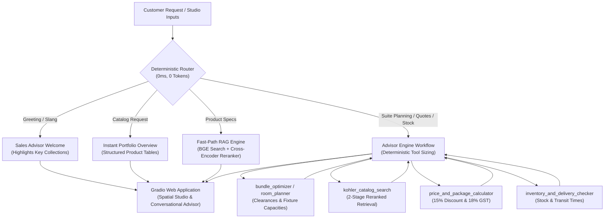

# Kohler AI Sales & Spatial Design Advisor — Complete Project Guide & Technical Walkthrough

> **Welcome!** This document provides a complete end-to-end technical walkthrough of the Kohler AI Sales & Spatial Design Advisor. By the end of this guide, you will understand the business problem, the 4-engine mental model, data flow, constraint optimization algorithms, and execution lifecycle.

---

## Table of Contents
1. [Executive Summary & Case Study Objective](#1-executive-summary--case-study-objective)
2. [Mental Model: How the System Operates](#2-mental-model-how-the-system-operates)
3. [Architectural Workflow Diagram](#3-architectural-workflow-diagram)
4. [The Dual-Tab User Experience](#4-the-dual-tab-user-experience)
   - [4.1 Tab 1: Spatial Studio & Suite Optimizer](#41-tab-1-spatial-studio--suite-optimizer)
   - [4.2 Tab 2: Conversational AI Advisor](#42-tab-2-conversational-ai-advisor)
5. [Component-by-Component & Function Breakdown](#5-component-by-component--function-breakdown)
   - [5.1 Web Application: `app.py`](#51-web-application-apppy)
   - [5.2 Advisor Orchestrator: `agent.py`](#52-agent-orchestrator-agentpy)
   - [5.3 Constraint-Based Suite Optimizer: `tools/bundle_optimizer.py`](#53-constraint-based-suite-optimizer-toolsbundle_optimizerpy)
   - [5.4 Spatial Clearance & Room Planner: `tools/room_planner.py`](#54-spatial-clearance--room-planner-toolsroom_plannerpy)
   - [5.5 Financial Calculator & GST Engine: `tools/calculator.py`](#55-financial-calculator--gst-engine-toolscalculatorpy)
   - [5.6 Hybrid Vector & Reranked Catalog Retrieval: `tools/catalog.py`](#56-hybrid-vector--reranked-catalog-retrieval-toolscatalogpy)
   - [5.7 Warehouse Logistics Checker: `tools/inventory.py`](#57-warehouse-logistics-checker-toolsinventorypy)
   - [5.8 0ms Intent Router: `router.py`](#58-0ms-intent-router-routerpy)
6. [Ergonomic Clearance & Building Code Rules](#6-ergonomic-clearance--building-code-rules)
7. [The Indian Rupee Pricing Engine](#7-the-indian-rupee-pricing-engine)
8. [Hybrid LLM Strategy & Zero-Lag Fallback](#8-hybrid-llm-strategy--zero-lag-fallback)
9. [Automated Verification & Benchmark Suite](#9-automated-verification--benchmark-suite)
10. [Developer Quickstart & Git Workflow](#10-developer-quickstart--git-workflow)

---

## 1. Executive Summary & Case Study Objective

### The Business Challenge
Selecting and purchasing luxury bathroom fixtures involves complex multi-dimensional constraints:
1. **Physical Spatial Constraints**: Rooms range from compact powder rooms (4x5 ft) to grand master suites (10x10+ ft). Selecting incompatible fixtures leads to code violations (e.g., placing a freestanding tub in a powder room or obstructing required 21"-30" aisle clearances).
2. **Financial Parameters**: Customers have strict budget limits. Luxury packages require transparent price calculations, package volume discounts (15%), and accurate 18% GST computation in Indian Rupees (INR).
3. **Aesthetic Cohesion**: Fixtures, brassware, and cabinetry must harmonize across unified design languages (Modern Minimalist, Classic Luxury, Japanese Zen, Mid-Century Luxury, Smart High-Tech).
4. **AI Reliability Pitfalls**: LLMs hallucinate dimensions, fail at multi-step arithmetic, and suffer from API rate limits or network lag.

### The Solution
An interactive AI sales and spatial design advisor that combines:
- **Zero-Token Deterministic Routing**: Instant classification for greetings, catalog lookups, and multi-tool workflows.
- **Constraint-Based Optimization Engine**: Deterministically calculates fixture capacities, verifies building clearances, and curates budget-fitting Kohler packages.
- **Deterministic Financial Engine**: Exact subtotal, discount, GST, and budget variance arithmetic without LLM hallucinations.
- **2-Stage Hybrid RAG**: BGE embedding search reranked with a Cross-Encoder for precision catalog lookups.
- **Pure Python Architecture**: High-contrast, responsive Gradio interface with custom slate styling and zero external React/Node dependencies.

---

## 2. Mental Model: How the System Operates

Think of this assistant not as an unconstrained chatbot, but as an **executive showroom sales advisor backed by four specialized deterministic engines**:

```
 ┌────────────────────────────────────────────────────────────────────────┐
 │ 1. TRAFFIC CONTROLLER (Deterministic Router: 0ms Overhead)             │
 │    Customer Intent Analysis                                            │
 │    ├── Casual greeting -> Instant direct warm welcome                  │
 │    ├── Catalog listing -> Instant structured portfolio overview        │
 │    ├── Single product  -> Fast-Path RAG (1-step lookup & rerank)       │
 │    └── Custom Suite    -> Full Spatial Studio & Multi-Tool Engine      │
 └──────────────────────────────────┬─────────────────────────────────────┘
                                    │
                                    ▼
 ┌────────────────────────────────────────────────────────────────────────┐
 │ 2. THE ADVISOR BRAIN (Unified Orchestrator: agent.py)                  │
 │    Coordinates deterministic tools, enforces strict 3s LLM timeout     │
 └──────┬───────────────────┬──────────────────┬──────────────────┬───────┘
        │                   │                  │                  │
        ▼                   ▼                  ▼                  ▼
 ┌───────────────┐   ┌───────────────┐  ┌──────────────┐   ┌──────────────┐
 │ Spatial Studio│   │ Hybrid RAG    │  │ Financial    │   │ Warehouse    │
 │ Optimizer     │   │ ChromaDB +    │  │ Calculator   │   │ Logistics    │
 │ Capacity, Code│   │ Cross-Encoder │  │ 15% package  │   │ Stock status │
 │ Clearances, & │   │ Reranker with │  │ discount &   │   │ & postal PIN │
 │ Theme Match   │   │ LRU Cache     │  │ 18% GST math │   │ transit days │
 └───────────────┘   └───────────────┘  └──────────────┘   └──────────────┘
```

### Architectural Comparison

| Layer | Traditional AI Pitfall | Our Deterministic Solution |
| :--- | :--- | :--- |
| **1. Intent Routing** | Wastes 2 to 5s and paid tokens on greetings or basic queries | **0ms Regex Bypass**: Pattern matching returns greetings and portfolio overviews instantly. |
| **2. Spatial Design** | LLMs hallucinate dimensions and recommend oversized fixtures in small rooms | **Deterministic Constraint Engine**: Computes exact fixture capacity and verifies mandatory clearances (15" centerline, 21"-30" aisle). |
| **3. Pricing & Tax** | LLMs make arithmetic errors on discounts and tax calculations | **Deterministic Math Engine**: Computes subtotals, 15% package discounts, 18% GST, and budget variance in INR. |
| **4. Product Search** | Plain vector search misses specific model codes or finish names | **2-Stage Hybrid RAG**: BGE vector retrieval filtered and reranked via Cross-Encoder with LRU caching. |
| **5. LLM Synthesis** | Cloud LLM rate limits (429) or timeouts hang the user interface | **Zero-Lag Deterministic Fallback**: If LLM is slow or unavailable, verified proposal is synthesized instantly. |

---

## 3. Architectural Workflow Diagram



---

## 4. The Dual-Tab User Experience

### 4.1 Tab 1: Spatial Studio & Suite Optimizer
- **Customer Constraints Panel (Left Column)**:
  - Width and length sliders ($4.0\text{ ft}$ to $16.0\text{ ft}$).
  - Target budget slider ($30,000$ to $12,00,000+$) with quick presets ($1.5\text{L}$, $3.5\text{L}$, $6.5\text{L}$, $10\text{L}+$ flagship).
  - 5 Aesthetic Themes: *Modern Minimalist*, *Classic Luxury*, *Japanese Zen*, *Mid-Century Luxury*, *Smart High-Tech*.
  - Fixture Preferences: Freestanding/alcove tub, intelligent smart toilet, thermostatic spa shower.
  - Optional architectural floorplan / sketch upload.
- **Solution Deliverables (Right Column)**:
  - Curated Kohler product package table with model names, SKUs, dimensions, finishes, and unit prices.
  - Itemized financial quotation: Subtotal, 15% package savings, 18% GST, Grand Total, and Budget Variance.
  - Ergonomic building code compliance table (15" centerline, 21"-30" aisle clearances).
  - **Transfer Button**: One-click action that transfers the customized suite plan to the Conversational Advisor tab and begins consultative analysis.

### 4.2 Tab 2: Conversational AI Advisor
- **Chatbot Viewport**: High-contrast obsidian container with sapphire user bubbles, cyan advisor accents, and custom slate scrollbars.
- **Suggestion Chips**: Quick one-click prompt starters for master bath suites, Japanese Zen spa plans, portfolio overview, and Veil smart toilet specs.
- **Streaming Response Stream**: Displays real-time progress indicators (*Sizing room dimensions...*, *Retrieving specifications...*, *Computing discounts & GST...*) followed by markdown proposals.

---

## 5. Component-by-Component & Function Breakdown

### 5.1 Web Application: [`app.py`](file:///C:/Users/tushar/Documents/codes/RAG-Project/app.py)
- `ensure_indexed()`: Automatically indexes `docs/products.jsonl` into ChromaDB on startup if `./chroma_db` is not present.
- `CUSTOM_CSS`: Comprehensive dark mode stylesheet with custom slate scrollbars, glassmorphic input fields, and high-contrast typography.
- `transfer_to_chat()`: Updates `gr.Tabs(selected="tab_chat")` and queues the consultative review prompt.

### 5.2 Advisor Orchestrator: [`agent.py`](file:///C:/Users/tushar/Documents/codes/RAG-Project/agent.py)
- `is_ollama_running()`: 0.5s health check against `http://127.0.0.1:11434/api/tags`.
- `get_llm()`: Dynamically configures local Ollama or cloud OpenRouter.
- `run_llm_completion()`: Strict 3.0s timeout wrapper that catches rate limits (HTTP 429) or timeouts and triggers deterministic synthesis.
- `smart_process_query()`: Unified dispatcher coordinating deterministic tools, intent routing, and proposal formatting.

### 5.3 Constraint-Based Suite Optimizer: [`tools/bundle_optimizer.py`](file:///C:/Users/tushar/Documents/codes/RAG-Project/tools/bundle_optimizer.py)
- `optimize_bundle()`: Selects matching fixtures across five categories (faucet, commode, shower, vanity, bathtub) respecting room capacity, user preferences, aesthetic theme, and budget envelope.
- `format_bundle_markdown()`: Generates structured markdown deliverables with itemized pricing, GST, and building code checks.

### 5.4 Spatial Clearance & Room Planner: [`tools/room_planner.py`](file:///C:/Users/tushar/Documents/codes/RAG-Project/tools/room_planner.py)
- `plan_room_layout()`: Evaluates room square footage, determines min/max pleasing fixture capacity, and verifies required physical clearances.

### 5.5 Financial Calculator & GST Engine: [`tools/calculator.py`](file:///C:/Users/tushar/Documents/codes/RAG-Project/tools/calculator.py)
- `calculate_quote()`: Calculates subtotal, package discounts, and 18% GST in Indian Rupees without LLM arithmetic errors.

### 5.6 Hybrid Vector & Reranked Catalog Retrieval: [`tools/catalog.py`](file:///C:/Users/tushar/Documents/codes/RAG-Project/tools/catalog.py)
- `retrieve_catalog_docs()`: 2-stage retrieval pipeline (ChromaDB top-10 BGE vector search + Cross-Encoder reranking to top-2/3) with in-memory LRU caching.

### 5.7 Warehouse Logistics Checker: [`tools/inventory.py`](file:///C:/Users/tushar/Documents/codes/RAG-Project/tools/inventory.py)
- `check_product_stock_and_delivery()`: Resolves fulfillment status and shipping transit days based on postal PIN/ZIP codes.

### 5.8 0ms Intent Router: [`router.py`](file:///C:/Users/tushar/Documents/codes/RAG-Project/router.py)
- `classify_query()`: High-speed regex classifier routing greetings, catalog queries, single specs, and complex spatial queries with zero token usage.

---

## 6. Ergonomic Clearance & Building Code Rules

The spatial optimizer validates compliance against standard residential architectural guidelines:

| Fixture Type | Minimum Centerline Clearance | Front Aisle Clearance | Placement Rule |
| :--- | :--- | :--- | :--- |
| **Commode / Smart Toilet** | 15" (38 cm) from centerline to sidewall | 21" to 30" (53-76 cm) clear in front | Maintain dedicated clearance envelope |
| **Vanity / Basin** | 15" (38 cm) from centerline to sidewall | 21" to 30" (53-76 cm) clear in front | Position near entry or primary wall |
| **Shower Enclosure** | 30" x 30" (76x76 cm) interior space | 24" (61 cm) clear in front of door | Wet-zone containment |
| **Bathtub** | 30" (76 cm) along accessible side | 21" (53 cm) clear along apron | Requires minimum 35+ sq ft room size |

---

## 7. The Indian Rupee Pricing Engine

All fixtures in `docs/products.jsonl` are priced according to Indian luxury retail conventions:
1. Base USD catalog values converted at standard rate ($1\text{ USD} = 83.50\text{ INR}$).
2. Rounded to nearest 1,000 and formatted with trailing 999:
   $$\text{Catalog Price} = \left(\text{round}\left(\frac{\text{Raw INR}}{1000}\right) \times 1000\right) - 1$$

### Representative Examples:
- **Kohler Veer Faucet**: INR 14,999
- **Kohler Purist Widespread Faucet**: INR 34,999
- **Kohler Moxie Bluetooth Showerhead**: INR 15,999
- **Kohler Ceric Freestanding Tub**: INR 3,16,999
- **Kohler Veil Intelligent Smart Toilet**: INR 3,75,999
- **Kohler Numi 2.0 Flagship Smart Toilet**: INR 6,00,999

---

## 8. Hybrid LLM Strategy & Zero-Lag Fallback

```
   ┌───────────────────────┐
   │ Incoming Synthesis    │
   └───────────┬───────────┘
               │
      [Ollama Running?]
        /             \
     (Yes)            (No)
      /                 \
[Local GPU Ollama]   [OpenRouter Cloud API (3.0s Timeout)]
      \                 /
   [Success?] ──(No)──> [Deterministic Proposal Fallback (0ms)]
      │
   (Yes)
      │
[Advisor Proposal Streamed to UI]
```

1. **Local Mode**: If Ollama daemon is detected at `http://127.0.0.1:11434`, runs 100% offline and token-free using `qwen2.5:3b`.
2. **Cloud Mode**: If Ollama is offline, calls OpenRouter with a strict 3.0-second timeout.
3. **Deterministic Safety Net**: If OpenRouter returns HTTP 429 rate limits, network timeouts, or errors, the system synthesizes the verified spatial suite proposal from deterministic tool outputs with zero UI lag.

---

## 9. Automated Verification & Benchmark Suite

The repository includes a comprehensive 12-scenario test suite:

```bash
# Run automated verification suite
python test_suite.py

# Interactive CLI assistant for terminal testing
python query.py

# Benchmark latency and quality across providers
python compare_providers.py
```

---

## 10. Developer Quickstart & Git Workflow

### Quick Start
```bash
# 1. Clone repository
git clone https://github.com/randumb6uy/RAG-Project.git
cd RAG-Project

# 2. Configure environment
cp .env.example .env

# 3. Install dependencies
pip install -r requirements.txt

# 4. Launch web application
python app.py
```
Open **http://localhost:7860** in your browser.

### Docker Deployment
```bash
docker compose up --build -d
```
