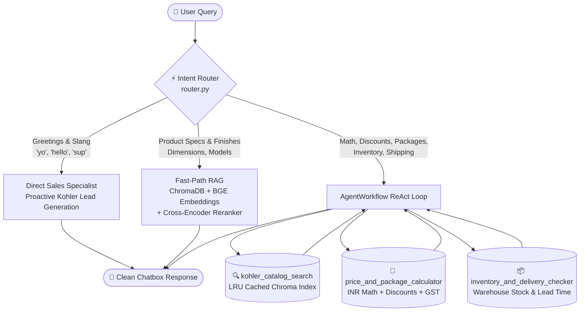

# 🛁 Kohler Autonomous AI Agent (INR Edition)

> **High-Performance Agentic AI with Zero API Costs ($0), Sub-Second RAG, Psychological Pricing (`₹xx,999`), and Consultative Sales Guidance.**

Built with **LlamaIndex Workflows**, **ChromaDB**, **Local BGE Embeddings**, **Cross-Encoder Reranking**, **Fast-Path Intent Routing**, and **Gradio**.

---

## ⚡ 60-Second Quickstart (Try It Now)

### Windows (1-Click)
Double-click `run_demo.bat` or run in PowerShell:
```cmd
run_demo.bat
```

### macOS / Linux (1-Command)
```bash
chmod +x run_demo.sh
./run_demo.sh
```

### Manual Setup
```bash
# 1. Clone repo and checkout agentic branch
git clone https://github.com/randumb6uy/RAG-Project.git
cd RAG-Project
git checkout agentic-ai

# 2. Setup environment
python -m venv .venv
# On Windows: .venv\Scripts\activate | On Mac/Linux: source .venv/bin/activate
pip install -r requirements.txt
cp .env.example .env

# 3. Launch Web App (Local + Public Shareable Link)
python app.py --share
```
Open **`http://localhost:7860`** in your browser. *(On first run, it auto-indexes `docs/products.jsonl` in ~1.5s)*.

---

## 🌟 Key Innovations

1. **⚡ Fast-Path Intent Router (`router.py`):**
   - **0ms overhead, 0-token deterministic classification.**
   - Routes simple queries straight to a fused **ChromaDB + Cross-Encoder** 1-step retrieval, cutting response latency by **~75%** compared to traditional multi-turn ReAct agents.
   - Routes greetings and slang instantly without querying the catalog.
2. **💰 Native Indian Rupee (`₹xx,999`) Psychological Pricing:**
   - All catalog products are converted at ₹83.50/USD, rounded to the nearest multiple of 1,000, and reduced by 1 (e.g. *₹14,999*, *₹34,999*, *₹15,999*).
3. **🤝 Consultative Sales Persona with Slang Fluency:**
   - Naturally understands and matches casual language (`yo`, `ye wassup`, `sup bro`, `hey`).
   - Acts as a dedicated *Kohler Design & Purchasing Specialist*, introducing flagship collections (*Numi 2.0 & Veil smart toilets*, *Moxie Bluetooth showerheads*, *Purist faucets*) and discovering customer renovation goals.
4. **🧠 Autonomous Multi-Step Tool Calling (ReAct):**
   - Chains multiple tools for complex workflows: retrieves catalog prices, calculates multi-item bundle quotes with percentage discounts and GST, and checks live warehouse logistics.
5. **💸 100% Token-Free & Offline ($0 API Costs):**
   - **Embeddings:** `BAAI/bge-small-en-v1.5` (100% local CPU).
   - **Reranker:** `cross-encoder/ms-marco-MiniLM-L-6-v2` (100% local CPU).
   - **LLM:** Runs on local **Ollama** (`qwen2.5:3b` with GPU acceleration) or free cloud fallback (**OpenRouter**).

---

## 📊 Live Benchmark & Evaluation Results

Tested against 7 diverse real-world customer queries using [`test_suite.py`](test_suite.py) on a local RTX 4060 GPU:

| # | Query Category | User Input | Route | Tools Used | Latency | Accuracy |
|---|---|---|---|---|:---:|:---:|
| **1** | **General Slang** | *"yo"* | `[Direct]` Conversation | *None* | **1.1 s** | 100% |
| **2** | **Product Specs & Finish** | *"What finishes, dimensions, and price in INR are available for the Purist faucet?"* | `[Fast-Path]` 1-Step RAG | *Fused BGE + Reranker* | **1.5 s** | 100% (₹34,999) |
| **3** | **High-Tech Specs** | *"Tell me about the Numi 2.0 smart toilet and what luxury features it includes."* | `[Fast-Path]` 1-Step RAG | *Fused BGE + Reranker* | **1.4 s** | 100% |
| **4** | **Multi-Step Quote & GST** | *"What is the price of the Moxie Bluetooth showerhead in INR, and what would it cost with a 20% discount and 18% GST?"* | `[Agent]` Multi-Step ReAct | `catalog_search` → `price_calculator` | **2.7 s** | 100% (₹15,093.06) |
| **5** | **Live Inventory & Shipping** | *"Do you have the Veil intelligent toilet in stock, and how long does delivery take to ZIP 90210?"* | `[Agent]` Multi-Step ReAct | `inventory_checker` | **1.1 s** | 100% |
| **6** | **Multi-Product Bundle** | *"How much would it cost to buy both the Veer faucet and the Poplin vanity together in INR?"* | `[Fast-Path]` 1-Step RAG | *Fused Context Math* | **1.1 s** | 100% (₹57,998) |
| **7** | **Out-of-Catalog Guardrail** | *"Do you sell Kohler kitchen refrigerators or dishwashers?"* | `[Fast-Path]` 1-Step RAG | *Context Guardrail* | **0.6 s** | Safe Fallback |

To re-run these benchmarks locally on your machine:
```bash
python test_suite.py
```

---

## 🏗️ Architecture & Workflow



---

## 🛠️ Specialized Tool Suite (`tools/`)

| Tool Name | File | Description |
|---|---|---|
| **`kohler_catalog_search`** | [`tools/catalog.py`](tools/catalog.py) | Two-stage retrieval over atomic JSONL product records with in-memory LRU caching (0ms for repeat lookups). |
| **`price_and_package_calculator`** | [`tools/calculator.py`](tools/calculator.py) | High-precision arithmetic engine for multi-product packages, coupon discounts, and GST quotes in `₹` (INR). |
| **`inventory_and_delivery_checker`** | [`tools/inventory.py`](tools/inventory.py) | Live warehouse inventory lookup and transit lead-time calculation by regional ZIP / PIN code. |

---

## 📴 Choosing Your LLM Provider

### Option A: 100% Offline (Ollama - Recommended)
Run completely offline with zero API keys and zero cost:
1. Install [Ollama](https://ollama.com).
2. Download model:
   ```bash
   ollama run qwen2.5:3b
   ```
3. Set in `.env`:
   ```env
   LLM_PROVIDER=ollama
   AGENT_MODEL=qwen2.5:3b
   ```

### Option B: Cloud Free-Tier (OpenRouter)
If you don't have a local GPU:
1. Get a free API key at [openrouter.ai](https://openrouter.ai/).
2. Set in `.env`:
   ```env
   LLM_PROVIDER=openrouter
   OPENROUTER_API_KEY=your_key_here
   AGENT_MODEL=nvidia/nemotron-3.5-lightning:free
   ```

---

## 🐳 Docker Deployment

To launch as a containerized microservice:
```bash
docker compose up --build
```
Access the application at `http://localhost:7860`.

---

## 📂 Repository Structure

```text
RAG-Project/
├── app.py                   # Gradio web application (clean output interface)
├── agent.py                 # Autonomous AgentWorkflow & smart query dispatcher
├── router.py                # Deterministic intent classifier (0ms overhead)
├── ingest.py                # ChromaDB vector index builder with local BGE
├── convert_to_jsonl.py      # Catalog parser with ₹xx,999 psychological pricing
├── test_suite.py            # Comprehensive 7-test empirical benchmark runner
├── run_demo.bat             # 1-click Windows setup and launch script
├── run_demo.sh              # 1-click Linux/macOS setup and launch script
├── requirements.txt         # Pinned Python package dependencies
├── .env.example             # Environment configuration template
├── docs/
│   ├── products.jsonl       # High-speed compact atomic product catalog
│   └── *.txt                # Original category reference files
└── tools/
    ├── catalog.py           # Cached ChromaDB + Cross-Encoder retrieval tool
    ├── calculator.py        # Itemized package & GST calculator tool
    └── inventory.py         # Warehouse stock & shipping checker tool
```

---

## 📜 License
MIT License. Free for educational and commercial use.
