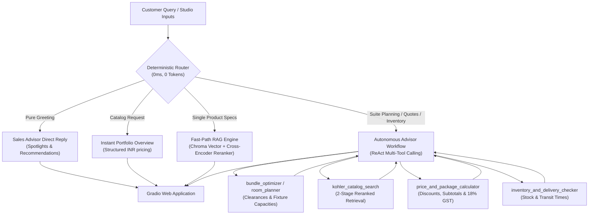

# Kohler AI Sales & Spatial Design Advisor

[](https://www.python.org/)
[](https://www.llamaindex.ai/)
[](https://www.trychroma.com/)
[](https://huggingface.co/BAAI/bge-small-en-v1.5)
[](https://gradio.app/)
[](LICENSE)

An interactive AI design assistant and sales advisor that automates personalized product bundle recommendations for the **Kohler Luxury Bathroom Collection (India: INR)**.

The system features **0ms Fast-Path Intent Routing**, **2-Stage Hybrid RAG (Vector Search + Cross-Encoder Reranking)**, **Spatial Studio & Constraint-Based Optimization**, **Multi-Item Package & GST Calculators**, and **Warehouse Fulfillment Tracking**, presented through a clean Gradio web interface.

---

## Submission Deliverables & Quick Links

| Deliverable | Description | Reference / Link |
| :--- | :--- | :--- |
| **1. Working Model** | Functional interactive prototype with Gradio Spatial Studio, ReAct Agent & 4 deterministic rule engines | Source code (`app.py`, `agent.py`, `tools/`), `run_demo.bat`, `run_demo.sh`, Docker |
| **2. Prompts Documentation (PDF)** | Comprehensive documentation of all AI prompts, system instructions, Modelfiles, schemas & workflows | [`Prompts_Documentation.pdf`](Prompts_Documentation.pdf) (Built via `python generate_prompts_pdf.py`) |
| **3. Video Demonstration** | 1-3 minute video walk-through demonstrating the working model in action | [`Demo.mp4`](Demo.mp4) / [Walkthrough Script](#video-demonstration) |
| **4. Presentation Deck (PDF)** | 4-slide executive presentation deck highlighting core approach, system architecture, tech stack & innovation pitch | [`Presentation_Deck.pdf`](Presentation_Deck.pdf) (Built via `python generate_presentation_deck_pdf.py`) |
| **5. Architectural Reference (PDF)** | Deep-dive mental model and architectural reference guide | [`Kohler_AI_Advisor_Mental_Model.pdf`](Kohler_AI_Advisor_Mental_Model.pdf) |

---

## Video Demonstration

- **Committed Video Demonstration File:** [`Demo.mp4`](Demo.mp4) *(Full HD Walkthrough Video)*
- **Interactive Live Demo:** Launch locally via `python app.py --share` or `run_demo.bat` to generate a live public URL.

### 1-3 Minute Demo Walkthrough Flow
1. **0:00 - 0:30 | 0ms Fast-Path Intent Routing & Catalog Overview**:
   - Type *"Hi"* or *"Show me the catalogue"*. Show instantaneous 0ms response, zero LLM tokens used, and structured INR price tables.
2. **0:30 - 1:15 | Spatial Studio 3D Constraint Solver**:
   - Navigate to the **Spatial Studio** tab. Adjust sliders (e.g. 7x8 ft, ₹3,00,000 INR budget, *Modern Minimalist* theme).
   - Click **"Optimize Bathroom Suite"** to see automatic fixture sizing, building code clearances (15" centerline, 21"-30" front), and 3D top-down visualizer.
3. **1:15 - 2:00 | Seamless Transfer to AI Sales Advisor**:
   - Click **"Transfer to Advisor Chat"**. Observe the ReAct orchestrator formulate an itemized proposal with curated Kohler fixtures.
4. **2:00 - 2:40 | Deterministic Math, 18% GST & Logistics**:
   - Observe automatic 15% package discount savings, exact 18% GST calculation in INR, and PIN-code warehouse lead times without mental arithmetic hallucinations.
5. **2:40 - 3:00 | 100% Offline Edge Capability**:
   - Highlight local Ollama `qwen2.5:3b` execution with zero external cloud dependencies.

---

- **Fast-Path Deterministic Router (0ms Overhead, Zero Tokens)**:
  Instantly routes greetings, full catalog overviews, single-spec lookups, and multi-step tool calls without token usage or latency.
- **Spatial Studio & Suite Optimizer (`bundle_optimizer`)**:
  Takes bathroom dimensions (width x length), budget limits, aesthetic themes (Modern Minimalist, Classic Luxury, Japanese Zen, Mid-Century Luxury, Smart High-Tech), and fixture preferences to automate complete, budget-fitting Kohler packages with clearance compliance.
- **Precision Pricing & Package Calculator (`price_and_package_calculator`)**:
  Computes itemized quotes with subtotals, package discounts (15%), 18% GST, and budget variance in Indian Rupees (INR).
- **Warehouse Inventory & Transit Checker (`inventory_and_delivery_checker`)**:
  Provides fulfillment status, delivery lead times, and dispatch locations based on product type and delivery PIN/ZIP code.
- **2-Stage Local Hybrid RAG (`kohler_catalog_search`)**:
  Combines local BGE embeddings (`BAAI/bge-small-en-v1.5`) with a Cross-Encoder reranker (`ms-marco-MiniLM-L-6-v2`) and an in-memory LRU cache for 0ms repeated retrievals.
- **Dual LLM Provider Support**:
  - **100% Offline & Token-Free**: Local Ollama (`qwen2.5:3b` with GPU Flash Attention).
  - **Cloud Ready**: Fallback to OpenRouter free or paid tiers.
- **Self-Bootstrapping Gradio UI**:
  Automatically creates and populates the ChromaDB vector database on startup if not present. Includes public demo link generation (`--share`).

---

## Mental Model: How the System Operates

Think of this assistant as a **specialized luxury showroom advisor backed by four deterministic engines**:

```
 ┌────────────────────────────────────────────────────────────────────────┐
 │ 1. TRAFFIC CONTROLLER (Deterministic Router: 0ms, 0 Tokens)            │
 │    Customer Intent Analysis                                            │
 │    ├── Casual greeting -> Instant direct welcome                       │
 │    ├── Catalog listing -> Instant structured INR portfolio table       │
 │    ├── Single product  -> Fast-Path RAG (1 quick lookup)               │
 │    └── Complex design  -> Full Autonomous Advisor Workflow             │
 └──────────────────────────────────┬─────────────────────────────────────┘
                                    │
                                    ▼
 ┌────────────────────────────────────────────────────────────────────────┐
 │ 2. THE ADVISOR BRAIN (ReAct Orchestrator: LlamaIndex)                  │
 │    Plans steps, calls tools in sequence, synthesizes final answers     │
 └──────┬───────────────────┬──────────────────┬──────────────────┬───────┘
        │                   │                  │                  │
        ▼                   ▼                  ▼                  ▼
 ┌───────────────┐   ┌───────────────┐  ┌──────────────┐   ┌──────────────┐
 │ Spatial Studio│   │ RAG Search    │  │ Calculator   │   │ Logistics    │
 │ Room Planner  │   │ ChromaDB +    │  │ Exact math,  │   │ Real-time    │
 │ & Clearances  │   │ Cross-Encoder │  │ 15% disc,    │   │ stock & ZIP  │
 │ Validator     │   │ Reranker      │  │ 18% GST INR  │   │ transit days │
 └───────────────┘   └───────────────┘  └──────────────┘   └──────────────┘
```

### Architecture Comparison

| Layer | Traditional AI Pitfall | Our Solution & Mental Model |
| :--- | :--- | :--- |
| **1. Intent Routing** | Wastes 2 to 5s and paid LLM tokens on greetings or basic queries | **0ms Deterministic Bypass**: Regex & keyword matching bypasses LLMs entirely for deterministic answers. |
| **2. Spatial Design** | LLMs hallucinate dimensions and recommend oversized bathtubs in small powder rooms. | **Deterministic Constraint & Clearance Rule Engine**: Computes exact fixture capacity and checks mandatory building code clearances (15" centerline, 21"-30" aisle). |
| **3. Pricing & Tax** | LLMs make arithmetic errors and hallucinate package discounts and taxes. | **Deterministic Math Engine**: LLM delegates all math to Python (`calculator.py`) calculating subtotals, tier discounts, and 18% GST in INR. |
| **4. Product Search** | Plain vector search misses specific model codes or exact finish names. | **2-Stage Hybrid RAG**: Fast BGE embedding vector search filtered and precision-reranked via Cross-Encoder with LRU cache. |

---

## Architecture & Query Lifecycle



---

## Quick Start

### 1. Prerequisites
- **Python 3.10+** (Python 3.12 recommended)
- **Git**
- *(Optional for 100% offline mode)* [Ollama](https://ollama.com/) with `ollama pull qwen2.5:3b`

### 2. Clone the Repository
```bash
git clone https://github.com/<your-username>/RAG-Project.git
cd RAG-Project
```

### 3. Create & Activate Virtual Environment
```bash
# Windows
python -m venv .venv
.venv\Scripts\activate

# Linux / macOS
python3 -m venv .venv
source .venv/bin/activate
```

### 4. Install Dependencies
```bash
pip install -r requirements.txt
```

### 5. Configure Environment Variables
Copy `.env.example` to `.env`:
```bash
# Windows
copy .env.example .env

# Linux / macOS
cp .env.example .env
```

Edit `.env` to configure your preferred LLM provider:
```ini
# Option A: 100% Local & Token-Free via Ollama
LLM_PROVIDER=ollama
AGENT_MODEL=qwen2.5:3b

# Option B: Cloud via OpenRouter (Automatic fallback if Ollama is not running)
OPENROUTER_API_KEY=sk-or-v1-...
OPENROUTER_MODEL=nvidia/nemotron-3.5-lightning:free
```

### 6. Launch the Gradio Web Application
```bash
# Launch directly
python app.py

# Or use the quick-launch scripts
run_demo.bat     # Windows
./run_demo.sh    # Linux / macOS
```
Open **http://localhost:7860** in your browser.

> **Public Sharing**: Run `python app.py --share` or set `SHARE_PROTOTYPE=true` in `.env` to generate a public 72-hour temporary URL for live client demonstrations.

---

## Example Queries & Capabilities

Try these prompts in the Gradio UI:

| Category | Example Prompt | Active Route & Tools |
| :--- | :--- | :--- |
| **Catalog Exploration** | *"Show me the catalogue and all product categories."* | Portfolio Overview |
| **Compact Powder Room** | *"I have a 4x5 ft powder room, what products will fit nicely without looking cramped?"* | Room Layout Planner |
| **Master Bath Suite** | *"Plan a luxury 10x10 ft master bathroom suite with the best Kohler products."* | Spatial Studio & Suite Optimizer |
| **Fixture Clearances** | *"What is the minimum and maximum number of products I can fit into a 7x7 ft bathroom while keeping it pleasing?"* | Room Layout Planner |
| **Specific Specs & Finish** | *"What finishes and dimensions are available for the Purist faucet?"* | Fast-Path Catalog Search |
| **Multi-Item Quote + Tax** | *"What would the Moxie Bluetooth showerhead cost with a 15% discount and 18% GST?"* | Price & Package Calculator |
| **Inventory & Logistics** | *"Do you have the Veil intelligent toilet in stock for delivery to PIN 400001?"* | Inventory & Delivery Checker |

---

## Testing & Verification

The repository includes automated test suites and benchmarking tools:

### Automated 12-Scenario Test Suite
Runs an end-to-end evaluation across greetings, spatial sizing, calculations, inventory, and out-of-catalog boundary checks:
```bash
python test_suite.py
```

### Interactive Terminal CLI
Test the autonomous advisor in a fast, lightweight terminal loop:
```bash
python query.py
```

### Mental Model & Architecture PDF Reference
A publication-grade technical specification and architecture guide is included as a PDF:
```bash
# Generate / Rebuild the Mental Model PDF
python generate_mental_model_pdf.py
```
Outputs: `Kohler_AI_Advisor_Mental_Model.pdf` (covering the 4-engine model, spatial building code clearances, Indian Rupee math, and zero-lag fallback).

### Multi-Provider Benchmark
Compare latency, tool accuracy, and response quality across local and cloud models:
```bash
python compare_providers.py
```

---

## Docker Deployment

To build and run the application in a lightweight container:

```bash
# Build and run with Docker Compose
docker compose up --build -d

# View logs
docker compose logs -f
```
Access the application at **http://localhost:7860**.

---

## Project Structure

```
RAG-Project/
├── docs/
│   └── products.jsonl                 # 30+ structured Kohler luxury product records in INR
├── tools/
│   ├── __init__.py                    # Tool exports and registry
│   ├── bundle_optimizer.py            # Constraint-based suite optimizer & financial engine
│   ├── catalog.py                     # 2-Stage ChromaDB + Cross-Encoder retrieval tool
│   ├── room_planner.py                # Spatial layout, clearances & fixture capacity tool
│   ├── calculator.py                  # Subtotal, discount & 18% GST quotation tool
│   └── inventory.py                   # Real-time stock status & delivery lead time tool
├── app.py                             # Polished Gradio Web UI with Spatial Studio & AI Advisor
├── agent.py                           # LlamaIndex AgentWorkflow & Hybrid Routing orchestrator
├── router.py                          # Deterministic 0ms intent classifier
├── ingest.py                          # Self-bootstrapping ChromaDB vector store indexer
├── query.py                           # Interactive CLI assistant for terminal testing
├── test_suite.py                      # 12-test automated evaluation & verification suite
├── compare_providers.py               # LLM provider benchmark matrix
├── generate_prompts_pdf.py            # Publication-grade Prompts & Instructions PDF builder
├── Prompts_Documentation.pdf          # Committed Prompts & System Instructions PDF
├── generate_presentation_deck_pdf.py  # 4-Slide Executive Pitch Deck PDF builder
├── Presentation_Deck.pdf              # Committed 4-Slide Presentation Deck PDF
├── generate_mental_model_pdf.py       # Publication-grade Mental Model PDF builder
├── Kohler_AI_Advisor_Mental_Model.pdf # Generated architectural reference PDF
├── PROJECT_GUIDE.md                   # Comprehensive technical walkthrough & mental model
├── Modelfile                          # Custom Ollama Modelfile with spatial system prompt
├── requirements.txt                   # Production-ready Python dependencies
├── .env.example                       # Environment variables template
├── .gitignore                         # Comprehensive Git ignore rules
├── run_demo.bat                       # One-click Windows startup script
├── run_demo.sh                        # One-click Linux/macOS startup script
├── Dockerfile                         # Production Docker container image
├── docker-compose.yml                 # Multi-platform container configuration
└── README.md                          # Project documentation
```

---

## License

This project is licensed under the MIT License: see the [LICENSE](LICENSE) file for details.
