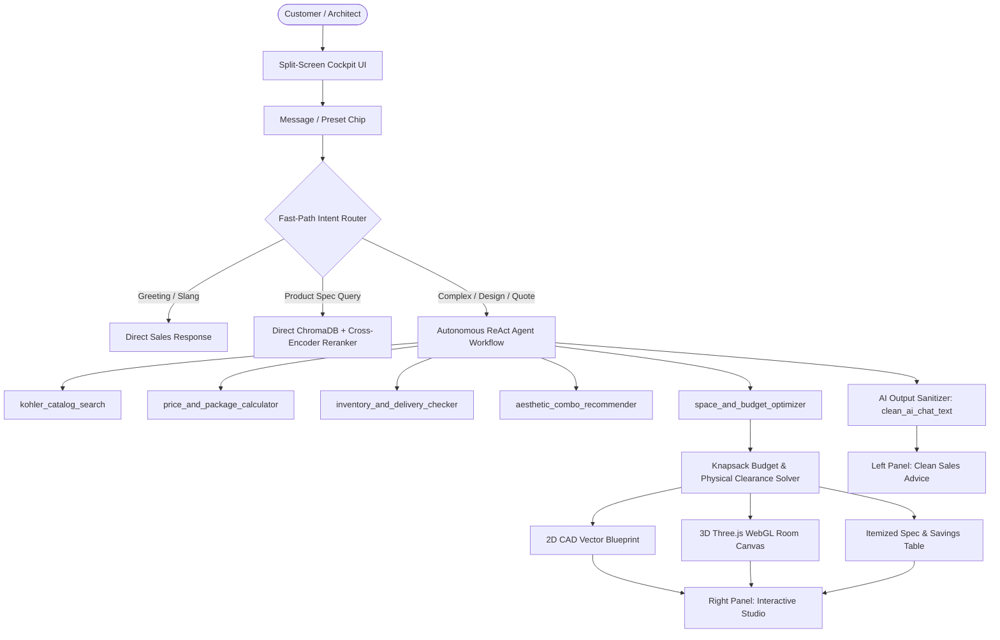
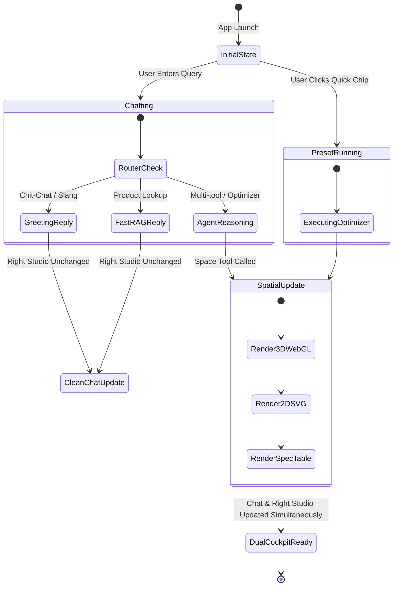

# 🛁 Kohler Design Concierge & Spatial Studio
## UI Feature Specification & Design System Guide

> **Document Version:** 1.0.0  
> **Status:** Production-Ready Specification  
> **Target Audience:** UI/UX Designers (Figma), Frontend Developers (React / Next.js / Tailwind / Gradio)  
> **Theme:** Obsidian Blue & Black Luxury Aesthetics

---

## 📑 Table of Contents
1. [Project Overview & Value Proposition](#1-project-overview--value-proposition)
2. [End-to-End System Architecture](#2-end-to-end-system-architecture)
3. [Core Feature Matrix & Capabilities](#3-core-feature-matrix--capabilities)
   - [3.1 Intelligent Fast-Path Intent Router](#31-intelligent-fast-path-intent-router)
   - [3.2 62-Product Luxury Catalog & Hybrid Search](#32-62-product-luxury-catalog--hybrid-search)
   - [3.3 Curated Aesthetic Matcher & Combo Discount Matrix](#33-curated-aesthetic-matcher--combo-discount-matrix)
   - [3.4 Live Inventory & Regional Transit Estimator](#34-live-inventory--regional-transit-estimator)
   - [3.5 Spatial & Budget Optimizer (Hero Feature)](#35-spatial--budget-optimizer-hero-feature)
   - [3.6 Dual-View Spatial Studio (2D CAD & 3D WebGL)](#36-dual-view-spatial-studio-2d-cad--3d-webgl)
4. [UI Layout & Component Architecture](#4-ui-layout--component-architecture)
   - [4.1 Cockpit Wireframe Diagram](#41-cockpit-wireframe-diagram)
   - [4.2 Component Hierarchy Breakdown](#42-component-hierarchy-breakdown)
5. [Blue & Black Design System & Tokens](#5-blue--black-design-system--tokens)
   - [5.1 Color Tokens](#51-color-tokens)
   - [5.2 Typography Scale](#52-typography-scale)
   - [5.3 Elevation, Borders & Glow Effects](#53-elevation-borders--glow-effects)
6. [Data Schemas & API Reference](#6-data-schemas--api-reference)
   - [6.1 Product Schema](#61-product-schema)
   - [6.2 Spatial Optimizer Request/Response](#62-spatial-optimizer-requestresponse)
   - [6.3 Frontend Event Endpoints](#63-frontend-event-endpoints)
7. [User Flows & State Transitions](#7-user-flows--state-transitions)

---

## 1. Project Overview & Value Proposition

The **Kohler Design Concierge & Spatial Studio** is an autonomous conversational AI sales specialist and architectural space-planning engine engineered specifically for the Kohler luxury market in India.

### Key Value Pillars
* **100% Token-Free Local Execution ($0 API Cost):** Runs fully offline on a local RTX 4060 GPU utilizing `qwen2.5:3b` with Flash Attention and ChromaDB local vector embeddings.
* **Instant Fast-Path Routing (0ms Overhead):** Deterministic regex and semantic router dispatches greetings and single-item searches in ~1s without multi-step reasoning latency.
* **Architectural Clearance Compliance:** Enforces National Building Code (NBC) sanitary clearance rules (15" centerline, 21" front clearance, 30" door swing arc).
* **Dual-View Spatial Studio:** Instantly generates both an architectural 2D CAD Blueprint (SVG) and an interactive 3D WebGL room model (Three.js OrbitControls).

---

## 2. End-to-End System Architecture



---

## 3. Core Feature Matrix & Capabilities

### 3.1 Intelligent Fast-Path Intent Router
* **Purpose:** Eliminates unnecessary LLM reasoning steps, ensuring instant feedback.
* **Routes:**
  1. `GREETING`: Detects conversational openings (*"hi"*, *"yo"*, *"wassup"*, *"hello"*). Responds in high-energy luxury consultant persona, introducing flagship Kohler products and leading into room upgrade discovery.
  2. `FAST_PATH_RAG`: Detects single-product questions (*"price of Purist faucet"*, *"Veil toilet features"*). Directly queries ChromaDB with Cross-Encoder reranking (~1.2s response).
  3. `AGENT`: Detects math, inventory, finish coordination, room dimensions, or budget constraints. Spawns autonomous multi-tool agent loop.

---

### 3.2 62-Product Luxury Catalog & Hybrid Search
* **Catalog Size:** 62 curated products tailored to the Indian market.
* **Pricing Currency:** Indian Rupees (**₹ INR**), structured with psychological luxury price points (e.g., `₹14,999`, `₹1,89,999`).
* **Categories Covered:**
  * **Faucets:** Purist, Artifacts, Composed, Parallel, Avid, Veil, Vibrant Brass/Chrome/Black.
  * **Vanities:** Poplin, Jacquard, Marabou, Harken, Damask, Persuade.
  * **Toilets:** Numi 2.0 Intelligent Smart Toilet, Veil Wall-Hung, San Souci, Brazn, Reach.
  * **Showers:** Moxie Bluetooth Harman Kardon Showerhead, Statement Rainhead, DTV Prompt Digital Valve, WaterTile Body Sprays.
  * **Tubs & Sinks:** Archer Soaking Tub, Memoirs Cast Iron Tub, Vox Vessel Basin, Ladena Undermount.

---

### 3.3 Curated Aesthetic Matcher & Combo Discount Matrix
* **Aesthetic Families:** Modern Minimalist, Heritage Traditional, Industrial Luxury, Zen Spa, High-Tech Futuristic.
* **Finish Harmony Engine:** Enforces metal finish coordination:
  * *Vibrant Moderne Brass*
  * *Matte Black*
  * *Polished Chrome*
  * *Brushed Nickel*
  * *Vibrant Titanium*
  * *Rose Gold*
* **Automatic Multi-Tier Combo Discount Matrix:**
  ```
  ┌─────────────────┬──────────────────────────────────────────┬──────────────┐
  │ Fixture Count   │ Bundle Tier Name                         │ Discount Off │
  ├─────────────────┼──────────────────────────────────────────┼──────────────┤
  │ 2 Fixtures      │ Aesthetic Duo Combo                      │ 10% OFF      │
  │ 3 Fixtures      │ Complete Design Suite                    │ 15% OFF      │
  │ 4 - 5 Fixtures  │ Full Master Bath Remodel Package         │ 18% OFF      │
  │ 6+ Fixtures     │ Whole-Home Ultimate Luxury Estate        │ 22% OFF      │
  └─────────────────┴──────────────────────────────────────────┴──────────────┘
  ```

---

### 3.4 Live Inventory & Regional Transit Estimator
* **Real-time Stock Status:** `In Stock`, `Low Stock (<5 units)`, `Custom Order`.
* **Warehouse Hubs:** Mumbai Central, Delhi NCR, Bengaluru South.
* **Pin Code Logistics:**
  * `110001` (Delhi / NCR): 2–3 business days.
  * `400001` (Mumbai / Western Hub): 1–2 business days.
  * `560001` (Bengaluru / Southern Hub): 2–3 business days.
  * Rest of India: 4–6 business days via Kohler Express Freight.

---

### 3.5 Spatial & Budget Optimizer (Hero Feature)
* **Input Parameters:**
  * `room_length_ft`: Room length (float, e.g. `8.0`).
  * `room_width_ft`: Room width (float, e.g. `6.0`).
  * `max_budget_inr`: Budget ceiling in ₹ INR (e.g. `250000`).
  * `style_preference`: Optional style filter (e.g. `"matte black"`, `"brass"`).
  * `must_have_categories`: Optional comma-separated categories.
* **Automatic Room Classifier:**
  * $\le 32\text{ sq ft}$: **Powder Room** (Faucet + Vanity + Toilet).
  * $33 - 58\text{ sq ft}$: **Standard Full Bathroom** (Faucet + Vanity + Toilet + Shower).
  * $> 58\text{ sq ft}$: **Luxury Primary Master Suite** (Faucet + Vanity + Toilet + Shower + Tub).
* **Building Code Compliance Engine:**
  * **15" Centerline Clearance:** Ensures toilet centerline is $\ge 15"$ away from side walls and vanities.
  * **21" Front Clearance:** Verifies $\ge 21"$ unobstructed walking clearance in front of fixtures.
  * **30" Door Arc Swing:** Mathematically validates that entrance door swings freely without colliding with fixtures.
  * **Wet / Dry Zoning:** Isolates shower enclosure to prevent moisture intrusion on vanities and drywall.

---

### 3.6 Dual-View Spatial Studio (2D CAD & 3D WebGL)
* **Tab 1: 🧊 3D WebGL Room Model:**
  * Powered by Three.js with WebGL acceleration.
  * OrbitControls: Left-Click to orbit 360°, Right-Click to pan, Scroll to zoom.
  * Cutaway architectural walls with tiled floor grid.
  * Procedurally modeled 3D fixtures (wood vanity, porcelain basin, metallic faucet, reflective wall mirror, toilet bowl/tank, transparent glass shower with metallic showerhead, freestanding tub).
  * Realistic PBR materials reflecting metallic finishes (Brass, Chrome, Matte Black, Nickel).
* **Tab 2: 📐 2D CAD Architectural Blueprint:**
  * Vector SVG scaled at 50 px/ft with 1-ft architectural grid.
  * Dimension callout lines with dual measurements (`8.0 ft (96")`).
  * Sanitary clearance dashed boxes (Cyan).
  * Door swing arc (Gold dashed arc).
* **Tab 3: 📋 Itemized Specs & Clearances Sheet:**
  * Tabular breakdown of SKU, category, dimensions, finish, and prices in ₹ INR.
  * Discount calculation, 18% GST calculation, and final grand total vs budget surplus badge.
  * 4 green checkmarks confirming code compliance.

---

## 4. UI Layout & Component Architecture

### 4.1 Cockpit Wireframe Diagram

```
+---------------------------------------------------------------------------------------------------------------+
|  🛁 KOHLER DESIGN CONCIERGE & SPATIAL STUDIO           [⚡ RTX 4060] [🔒 100% Offline] [🇮🇳 ₹ INR] [📐 2D/3D]  |
+-------------------------------------------------------+-------------------------------------------------------+
|  LEFT PANEL: AI SALES CONCIERGE (~45% Width)          |  RIGHT PANEL: KOHLER SPATIAL STUDIO (~55% Width)      |
|                                                       |                                                       |
|  +-------------------------------------------------+  |  +-------------------------------------------------+  |
|  | CHATBOT CONVERSATION VIEWPORT                   |  |  | STUDIO HEADER BAR                               |  |
|  |                                                 |  |  | [KOHLER STUDIO] ROOM TYPE • W' x L' • Finish    |  |
|  |  [User Bubble: Royal Blue Gradient]             |  |  | Budget Badge: [✅ Under Budget by ₹42,390 INR]   |  |
|  |  "Design an 8x6 ft modern bathroom under..."    |  |  +-------------------------------------------------+  |
|  |                                                 |  |  | TAB NAVIGATION:                                 |  |
|  |  [AI Bubble: Deep Slate Obsidian]              |  |  | [🧊 3D WebGL Room] [📐 2D Blueprint] [📋 Specs] |  |
|  |  "Greetings! I have curated your fixtures:      |  |  +-------------------------------------------------+  |
|  |   - Veer Faucet: ₹14,999.00 INR                 |  |  | ACTIVE VIEWPORT AREA (Height: 480px)            |  |
|  |   - Poplin Vanity: ₹42,999.00 INR               |  |  |                                                 |  |
|  |   - Puretide Bidet: ₹8,999.00 INR               |  |  |   Mode 1: Interactive Three.js Orbit Canvas     |  |
|  |   - WaterTile Sprays: ₹11,999.00 INR            |  |  |   Mode 2: 2D CAD Vector SVG Floorplan           |  |
|  |   Package Total: ₹76,436.53 (18% combo disc)    |  |  |   Mode 3: Itemized Financial Table              |  |
|  |   ✓ 15" sanitary clearance verified             |  |  |                                                 |  |
|  |   ✓ 30" door swing clear                        |  |  |                                                 |  |
|  |  👉 View interactive 3D model in studio right!" |  |  +-------------------------------------------------+  |
|  +-------------------------------------------------+  |  | FOOTER HINT: 🖱️ Left-Click: Orbit | Right: Pan   |  |
|  | [ Textbox Input: "Ask about Kohler..." ] [Send] |  |  +-------------------------------------------------+  |
|  +-------------------------------------------------+  |                                                       |
|  | QUICK ACTION CHIPS:                             |  |                                                       |
|  | [🗑️ Clear] [📐 8x6 Modern Bath] [🛁 Purist Suite] |  |                                                       |
|  | [🚽 Numi 2.0 Luxury Specs] [🌿 Zen Spa Master]   |  |                                                       |
|  +-------------------------------------------------+  |                                                       |
+-------------------------------------------------------+-------------------------------------------------------+
```

### 4.2 Component Hierarchy Breakdown
1. **`AppHeader`**: Brand logo, title, luxury subtitle, and 4 status pill badges.
2. **`CockpitSplitLayout`**: 2-column flex container (`45%` left / `55%` right on desktop, stacking on mobile).
3. **`ChatbotContainer`**:
   - `MessageList`: Renders user/bot messages with markdown styling.
   - `InputRow`: Text input field with focus glow and `Send ↵` button.
   - `QuickActionRow`: 4 pre-engineered query buttons for 1-click test runs + `Clear` button.
4. **`SpatialStudioContainer`**:
   - `StudioHeader`: Fixture room type, square footage, primary coordinated finish, and budget status badge.
   - `StudioTabs`: 3 interactive tab triggers (`3D WebGL`, `2D CAD Blueprint`, `Specs & Clearances`).
   - `Viewport3D`: Three.js WebGL canvas inside an isolated iframe.
   - `Viewport2D`: Scaled SVG architectural blueprint with dimension and clearance overlays.
   - `ViewportSpec`: Financial and building clearance breakdown table.
   - `ControlsHint`: Subtle controls guide for 3D interactions.

---

## 5. Blue & Black Design System & Tokens

### 5.1 Color Tokens
```css
:root {
  /* Surface Colors */
  --bg-canvas:         #060913; /* Deep Obsidian Black */
  --bg-surface-dark:   #0A0F1D; /* Midnight Slate Navy */
  --bg-card:           #0F172A; /* Slate Card Background */
  --bg-card-hover:     #1E293B; /* Elevated Card Hover */
  
  /* Border Colors */
  --border-subtle:     #1E293B; /* Subtle Slate Divider */
  --border-active:     #1E3A8A; /* Electric Blue Frame */
  --border-glow:       #38BDF8; /* Neon Cyan Active Ring */
  
  /* Brand Accents */
  --accent-blue-deep:  #1D4ED8; /* Royal Blue */
  --accent-blue-bright:#2563EB; /* Vibrant Electric Blue */
  --accent-cyan:       #38BDF8; /* Neon Sky Cyan */
  --accent-cyan-subtle:#0284C7; /* Gradient Transition Cyan */
  
  /* Typography */
  --text-primary:      #F8FAFC; /* Clean Crisp White */
  --text-secondary:    #CBD5E1; /* Ice-White Body */
  --text-muted:        #94A3B8; /* Slate Gray */
  --text-dim:          #64748B; /* Dark Muted Captions */
  
  /* Functional States */
  --status-success:    #34D399; /* Emerald Green (Budget Met & Clearances) */
  --status-warning:    #EAB308; /* Amber Gold (Door Swing Arc) */
  --status-error:      #F87171; /* Coral Red (Over Budget Alert) */
}
```

### 5.2 Typography Scale
* **Header Title:** `22px` • SemiBold (`700`) • `#F8FAFC`
* **Subtitles:** `13px` • Regular (`400`) • `#94A3B8`
* **Card Titles:** `15px` • Bold (`700`) • `#F8FAFC`
* **Body Text:** `13px - 14px` • Regular (`400`) • `#CBD5E1` (Line height `1.6`)
* **Technical Callouts / CAD Labels:** `11px - 12px` • Monospace / Bold • `#38BDF8`
* **Badges & Tags:** `11px` • Medium (`600`) • Letter spacing `0.5px`

### 5.3 Elevation, Borders & Glow Effects
* **Card Shadows:** `box-shadow: 0 4px 20px rgba(0, 0, 0, 0.6);`
* **Electric Cyan Glow:** `box-shadow: 0 0 15px rgba(56, 189, 248, 0.35);`
* **Royal Blue Glow:** `box-shadow: 0 0 15px rgba(37, 99, 235, 0.25);`
* **Corner Radius:**
  * Outer Containers: `12px`
  * Tab Buttons: `6px`
  * Action Chips & Badges: `20px` (Full Pill)
  * Message Bubbles: `12px` (with `2px` directional stem corner)

---

## 6. Data Schemas & API Reference

### 6.1 Product Schema (`docs/products.jsonl`)
```json
{
  "id": "KOH-FCT-001",
  "name": "Kohler Purist Single-Handle Bathroom Sink Faucet",
  "category": "faucets",
  "subcategory": "bathroom_sink_faucets",
  "type": "Single-Handle Faucet",
  "price": 38999.0,
  "currency": "INR",
  "finish": "Vibrant Moderne Brass",
  "finish_family": "Brass",
  "dimensions": "7.5\"H x 5.5\"reach x 2.0\"W",
  "aesthetic_style": "Modern Minimalist",
  "features": ["Solid brass construction", "Ceramic disc valves", "WaterSense certified 1.2 gpm"],
  "in_stock": true,
  "stock_quantity": 42,
  "lead_time_days": 2,
  "warehouse_location": "Mumbai Central",
  "warranty_years": 10
}
```

### 6.2 Spatial Optimizer Request & Response
```typescript
interface SpaceOptimizerRequest {
  room_length_ft: number;          // e.g. 8.0
  room_width_ft: number;           // e.g. 6.0
  max_budget_inr: number;          // e.g. 250000.0
  style_preference?: string;       // e.g. "matte black"
  must_have_categories?: string;   // e.g. "faucet, vanity, toilet, shower"
}

interface SpaceOptimizerResponse {
  clean_sales_text: string;        // Markdown formatted sales pitch & clearance checklist
  visual_studio_html: string;      // HTML containing 3D WebGL, 2D SVG, & Spec breakdown
}
```

### 6.3 Frontend Event Endpoints (Gradio API)
* `POST /api/predict/` (or `submit_chain`):
  * **Input:** `[message: string, history: MessageDict[]]`
  * **Yields:** `[updated_history: MessageDict[], updated_visual_html: string, session_state: object]`
* **Preset Buttons:**
  * `fn_index = 4`: 8x6 Modern Bath Plan (`"Design an 8x6 ft modern bathroom under ₹2,50,000 with matte black fixtures"`)
  * `fn_index = 5`: Purist Brass Suite (`"Recommend a matching Purist faucet and vanity package in Vibrant Moderne Brass with package discount"`)
  * `fn_index = 6`: Numi 2.0 Specs (`"Tell me about the Numi 2.0 smart toilet features, price in INR, and stock availability"`)
  * `fn_index = 7`: Zen Spa Master Bath (`"Design a 10x7 ft luxury zen spa master bathroom under ₹4,00,000 with soaking tub and shower"`)

---

## 7. User Flows & State Transitions



---

*This specification file is preserved directly in the project root at [`UI_FEATURE_SPEC.md`](file:///C:/Users/tushar/Documents/codes/RAG-Project/UI_FEATURE_SPEC.md).*
